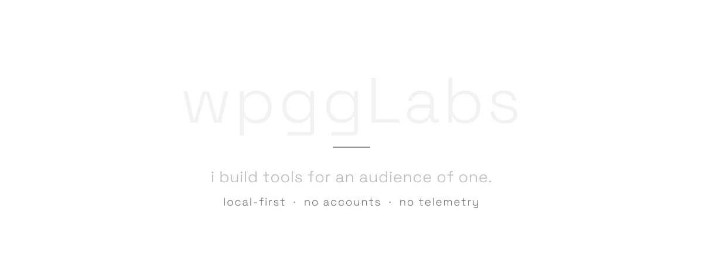

<picture>
  <source media="(prefers-color-scheme: dark)" srcset="./assets/hero-dark.svg" />
  <source media="(prefers-color-scheme: light)" srcset="./assets/hero-light.svg" />
  
</picture>

  <a href="https://wpgglabs.is-a.dev">is-a.dev</a>
  &nbsp;&nbsp;·&nbsp;&nbsp;
  <a href="https://twitter.com/wpggLabs">x</a>
  &nbsp;&nbsp;·&nbsp;&nbsp;
  <a href="mailto:wpgglabs@gmail.com">email</a>

