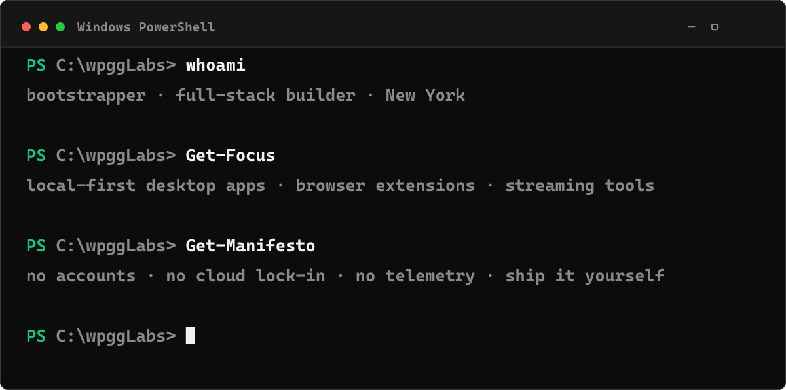
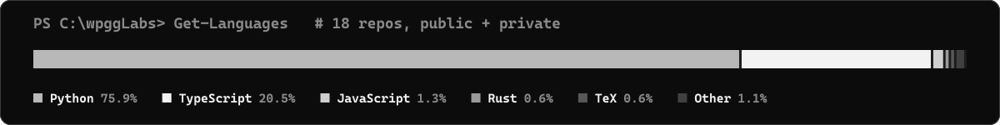

<!-- ════════════════════════════════════════════════════════════════════════ -->
<!--  wpggLabs · profile · terminal theme                                       -->
<!--  Sections between  <!--X:START--> / <!--X:END-->  are regenerated by       -->
<!--  scripts/build.py via .github/workflows/profile.yml — do not hand-edit.    -->
<!-- ════════════════════════════════════════════════════════════════════════ -->

<a href="https://wpgglabs.is-a.dev">
  
</a>

<p align="center">
  <a href="https://wpgglabs.is-a.dev"></a>
  <a href="https://twitter.com/wpggLabs"></a>
  <a href="mailto:wpgglabs@gmail.com"></a>
  <a href="https://github.com/wpggLabs?tab=repositories"></a>
  
</p>

<br/>

```powershell
PS C:\wpggLabs> Get-Bio | Format-List

Role     : Solo bootstrapper — full-stack, no funding, no team
Based    : New York
Thesis   : Own the whole stack, ship it yourself, keep it local-first
Building : Desktop studios · browser extensions · streaming tools
Values   : No accounts · No cloud lock-in · No telemetry
Loop     : Fast MVP -> real users -> polish -> product
```

<!-- everything below the fold is regenerated on a schedule -->

## `PS C:\wpggLabs> Get-Builds -Latest`

<!--BUILDS:START-->
| | project | what it is | stack | live |
|:--:|:--|:--|:--|:--:|
| 🛡️ | [`blockmaxxing`](https://github.com/wpggLabs/blockmaxxing) | a local-first browser extension that blocks stream-level (SSAI) Twitc… | `TypeScript` | [↗](https://wpgglabs.github.io/blockmaxxing/) |
| ⚡ | [`live-ratings`](https://github.com/wpggLabs/live-ratings) | Real-time Twitch chat rating overlay for streamers, running on Cloudf… | `JavaScript` | [↗](https://live-ratings.wpgglabs.workers.dev) |
| 🎬 | [`pdf2vid`](https://github.com/wpggLabs/pdf2vid) | Local-first desktop studio that turns PDFs into narrated read-along v… | `Rust` | [↗](https://wpgglabs.github.io/pdf2vid/) |
| 🖼️ | [`muraldesk`](https://github.com/wpggLabs/muraldesk) | A local-first desktop mural layer | `JavaScript` | [↗](https://wpgglabs.github.io/muraldesk/) |
| 🗒️ | [`nothi`](https://github.com/wpggLabs/nothi) | — | `TypeScript` | — |
| 📚 | [`gitsule`](https://github.com/wpggLabs/gitsule) | A personal library for GitHub discoveries | `TypeScript` | — |
<!--BUILDS:END-->

<sub>🔒 Plus a deep bench of <b>private builds</b> — receipt &amp; dosing tools, NYC civic-data apps, ML / clip pipelines. Counted (never named) in the numbers below.</sub>

<br/>

## `PS C:\wpggLabs> Get-Languages`



<br/>

## `PS C:\wpggLabs> Get-Stack`

<!--STACK:START-->
<p>
  
  
  
  
  
  
  
  
  
  
  
  
</p>
<!--STACK:END-->

<br/>

## `PS C:\wpggLabs> Get-Contributions -Animate`

<picture>
  <source media="(prefers-color-scheme: dark)" srcset="https://raw.githubusercontent.com/wpggLabs/wpggLabs/output/github-contribution-grid-snake-dark.svg" />
  <source media="(prefers-color-scheme: light)" srcset="https://raw.githubusercontent.com/wpggLabs/wpggLabs/output/github-contribution-grid-snake.svg" />
  
</picture>

<br/>

## `PS C:\wpggLabs> Get-Telemetry`

<p align="center">
  
  
</p>

<p align="center">
  <!--STATS:START-->
`8` public repos &nbsp;·&nbsp; `+9` private builds &nbsp;·&nbsp; `1` stars &nbsp;·&nbsp; `10` languages in rotation
<!--STATS:END-->
</p>

<br/>

<p align="center">
   flashy" />
</p>
<p align="center">
  <!--UPDATED:START-->
<sub>`last sync: 2026-07-05 11:17 UTC` — regenerated automatically by [profile.yml](.github/workflows/profile.yml)</sub>
<!--UPDATED:END-->
</p>
